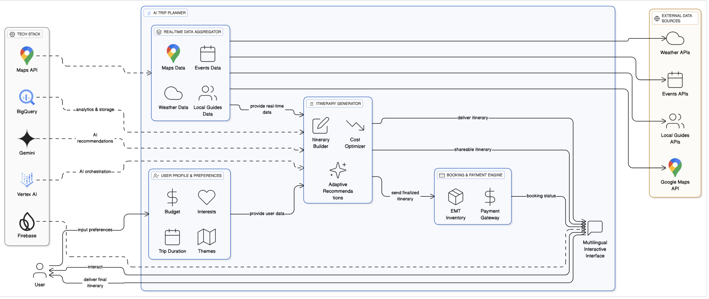

# AITripPlanner - Smart Travellers

An AI-powered trip planner solution that generates optimized itineraries based on your budget, interests, and travel duration — and lets you book everything and share the itinerary in one click.

---

## 🚀 Features (Prototype / MVP)

- Generate personalized itinerary (hotels + experiences) based on user inputs: theme, budget, travel duration.  
- Cost breakdown for all itinerary components (hotel, experience, transfers, meals etc.).  
- Booking endpoint integration (sandbox/test inventory) to reserve selected hotels or experiences.  
- Payment gateway integration (test mode) for one-click booking.  
- Shareable itinerary: download as PDF, or link that you can send.  
- Ability for user to modify itinerary (opt-in / opt-out items) to adjust cost before booking.

---

## 🧭 Why This Matters (Stand-Out Points)

- **All-in-one flow**: Plan → Book → Pay → Share without leaving the app.  
- **Real-time cost transparency**: See how skipping or adding items changes cost instantly.  
- **Local / Authentic Options**: Includes reviews & local experiences to give richer suggestions.  
- **User Flexibility**: Opt-out, toggle items, adjust budget.  
- **Shareable & Downloadable Itinerary**: Makes it easy to share your travel plan with others.

---

| Component                     | Tool / Framework                                                                                                                                                                                                                                                                                                                                                                                    | Role / Usage in Prototype                                                                                                                                                     |
| ----------------------------- | --------------------------------------------------------------------------------------------------------------------------------------------------------------------------------------------------------------------------------------------------------------------------------------------------------------------------------------------------------------------------------------------------- | ----------------------------------------------------------------------------------------------------------------------------------------------------------------------------- |
| **Frontend**                  | React + Vite (or React with Next.js)                                                                                                                                                                                                                                                                                                                                                                | UI screens: itinerary summary, cost breakdown, “Book & Pay”, share link / PDF                                                                                                 |
| **Backend**                   | Node.js + Express or Python + FastAPI                                                                                                                                                                                                                                                                                                                                                               | Handles booking API calls, payment gateway integration, PDF generation, share & itinerary data, user / auth logic                                                             |
| **Database**        | Supabase / Firebase / PostgreSQL                                                                                                                                                                                                                                                                                                                                                                    | Store user info, itineraries & components, booking & payment status, share tokens etc.                                                                                        |
| **Payment Gateway**           | Razorpay / Stripe (sandbox / test mode)                                                                                                                                                                                                                                                                                                                                                             | To process booking payments, handle callbacks, confirm payments                                                                                                               |
| **Booking / Inventory APIs**  | liteAPI / Booking.com sandbox / hotel / tours API                                                                                                                                                                                                                                                                                                                                                   | For fetching hotel / experience options and making booking stubs or real reservations in demo mode                                                                            |
| **Shareable Itinerary** | jsPDF                                                                                                                                                                                                                                                                                                                           | Generate shareable downloadable itineraries or send via link / email                                                                                                          |
| **Location Services**  | Google Maps API                                                                                                                                                                                                                                                                                                                                                                                     | Show hotel/POI locations, map route, distances for better experience comparison                                                                                               |
| **Google AI & ML**            | • Gemini (via Vertex AI / Gemini API) — for natural language / chat / theme-based user assistance;   • Vertex AI — for hosting models, prompt engineering, possibly fine-tuning / few-shot;   • Firebase — for user auth, possibly calling Gemini via Firebase + Vertex AI;   • BigQuery — for analytics, aggregating usage data, possibly for model training / insights & trend detection | To enable intelligent personalized suggestions, NLP/chat support, maybe adjusting itineraries via themes & preferences, multilingual support, analytics and model operations. |
| **Hosting**          | Netlify (free tiers)                                                                                                                                                                                                                                                                                                                                                     | Host frontend & backend; use CI/CD pipelines if possible                                                                                                                      |

---

## 🗺 User Flow

1. User enters trip parameters: destination, dates, themes, budget.  
2. System generates an itinerary with suggested hotels, experiences etc. + cost breakdown.  
3. User tweaks the itinerary (adds/removes experiences, meals, transfers) and sees updated cost.  
4. User clicks **Book & Pay** — backend creates booking stub + initiates payment via gateway.  
5. User completes payment in test mode.  
6. After payment success, app shows confirmation and allows user to download or share itinerary (PDF / link).

---

## Architectural Diagram

